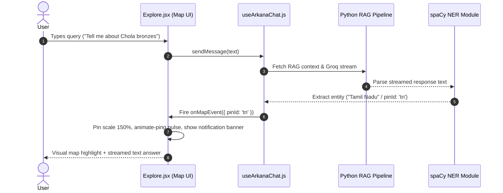
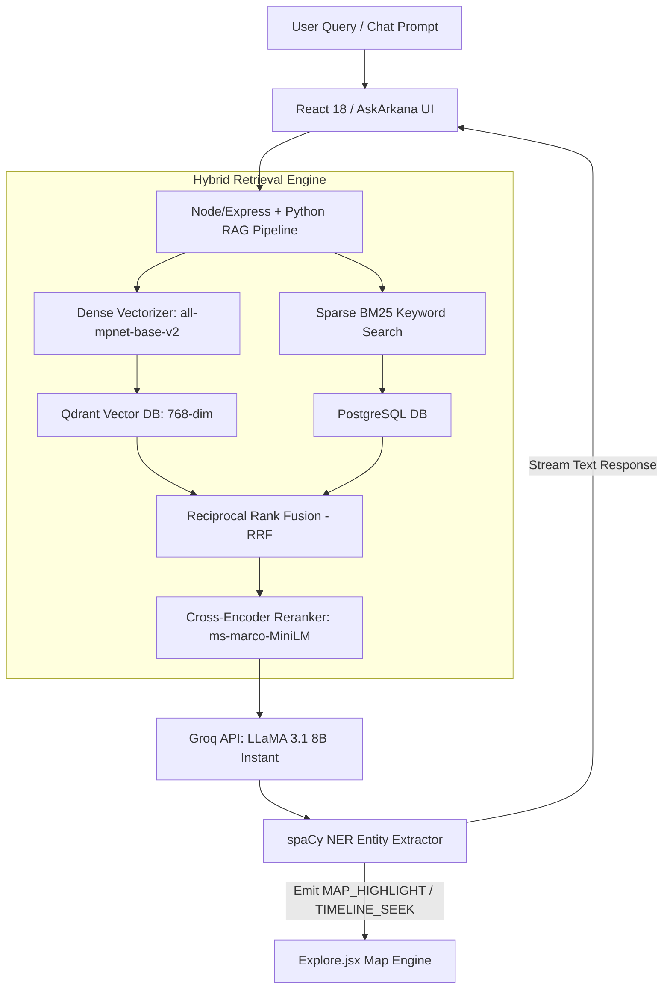

# 🎙️ Arkana — Developer Presentation & Speaker Script

> **Target Audience:** Developers, Technical Leads, Architects, and Project Stakeholders  
> **Presentation Focus:** Full-Stack Architecture, Modern React UI/UX Engineering, Map Engine & Spatial Synchronization, AI RAG Pipeline, and Interactive Cultural Mapping  
> **Estimated Duration:** 12–15 minutes (Presentation + Live Demo + Q&A)

---

## 📋 Executive Presentation Overview

| Section | Topic | Allocated Time | Core Objective |
|---|---|---|---|
| **01** | **Vision & Pitch** | 2 mins | Establish why Arkana exists and how it modernizes cultural heritage platforms. |
| **02** | **Frontend Engineering & UI/UX** | 3 mins | Showcase React 18 architecture, custom animation engines, shaders & cursor tracking. |
| **03** | **Interactive Map Engine Architecture** | 4 mins | Deep-dive into Leaflet integration, timeline spatial filtering, coordinate mapping, and NER map events. |
| **04** | **AI & Hybrid RAG Engine** | 4 mins | Deep-dive into Qdrant/Postgres vector architecture, RRF re-ranking, and spaCy NER map triggers. |
| **05** | **Roadmap & Q&A Prep** | 2 mins | Present future milestones and answer technical questions confidently. |

---

## ⚡ The 30-Second Elevator Pitch (Memorize This!)

> *"Arkana is a high-performance, editorial digital heritage platform that bridges ancient Indian history with modern web engineering. Think of Google Arts & Culture, but built with custom React 18 geometric transitions, WebGL shaders, spatial map timelines, and a hybrid RAG pipeline combining Qdrant vector search, CLIP computer vision, and Groq LLMs that dynamically trigger interactive map state updates."*

---

## 🎬 Detailed Slide-by-Slide & Demo Walkthrough Script

### Section 1: Introduction & Project Vision (2 Minutes)

#### 🗣️ Speaker Script (What to say)
> "Good [morning/afternoon] everyone. Today, I'm excited to present **Arkana**—an interactive digital platform for exploring Indian Cultural Heritage.
>
> Standard heritage and archival websites often suffer from two major flaws: they feel like static 1990s encyclopedias, and their search interfaces are rigid keyword lookups that lack contextual intelligence.
>
> Arkana fixes both. We've built an artsy, editorial digital experience that combines **cutting-edge web animations** with an **intelligent AI retrieval pipeline**. It allows users to explore India’s architectural wonders, dynasties, and art forms across time and space."

#### 💻 Technical Hooks (Key points to highlight)
* **Design Philosophy:** Luxury editorial aesthetic (gold `#8b6914`/`#c9a227` accents on dark warm slate/beige).
* **Core Stack:** React 18, Vite, Tailwind CSS + custom Vanilla CSS animation design tokens, Node/Express, Qdrant Vector DB, Python RAG pipeline.

---

### Section 2: Frontend Engineering & UI/UX Innovations (3 Minutes)

#### 🗣️ Speaker Script (What to say)
> "Let's start with the frontend architecture. We created a custom design system built on **React 18** and **Vite**, backed by specialized animation micro-services inside the component layer.
>
> Here are four signature UI innovations we engineered:
>
> 1. **Geometric Wipe Page Transitions:** Navigating between routes triggers a multi-strip horizontal CSS overlay (`TransitionOverlay.jsx`) that creates a cinematic wipe effect while pre-loading route assets.
> 2. **Index-Aware HSL Pointer Cursor:** The cursor (`GlobalCursor.jsx`) smoothly morphs its HSL hue based on which card index or category you hover over.
> 3. **Coordinate-Origin Modal Expansion:** Clicking an artifact card (`ArtifactCard.jsx`) calculates its exact bounding box origin. The detail modal (`CardModal.jsx`) scales out directly from that physical coordinate with 3D perspective tilt and text lines animating upward (`copy-wrap`).
> 4. **Liquid Displacement Shaders:** WebGL shader effects (`LiquidImage.jsx`) for fluid distortion transitions on hero images."

#### 🛠️ Code References for Developers
* `arkana-react/src/components/TransitionOverlay.jsx` — Multi-strip horizontal CSS wipe sequence.
* `arkana-react/src/components/GlobalCursor.jsx` — Global mouse tracking and dynamic HSL hue calculation.
* `arkana-react/src/components/CardModal.jsx` — Dynamic transform scale origin calculations & 3D tilt tracking.
* `arkana-react/src/components/LiquidImage.jsx` — WebGL liquid displacement shader canvas.

---

### Section 3: Deep-Dive — How the Map Function Works (4 Minutes) 🗺️

#### 🗣️ Speaker Script (What to say)
> "Now let's zoom in on one of Arkana's core technical pillars: **The Interactive Spatial Map Engine**.
>
> The map isn't just a static graphic—it's a two-way reactive state machine that coordinates geographical positioning, temporal filtering, and real-time AI events. Here is how the map function works under the hood:
>
> **1. Dual Map Engine Architecture:**
> - In our static prototype (`arkana/js/exploremap.js`), we utilize **Leaflet.js** with custom tilesets, SVG pin markers, and smooth camera panning using `map.flyTo([lat, lng], zoom)`.
> - In our React SPA (`Explore.jsx`), we engineered a lightweight vector spatial map using coordinate percentage positioning (`top: %`, `left: %`), custom SVG radial dot-grids, and territory blur gradients for 60fps performance on all devices.
>
> **2. Temporal Timeline Synchronization (1000 BCE – 2024 CE):**
> - The map is paired with a dynamic timeline slider at the bottom. A mathematical interpolation formula converts the slider range `(0–100)` into exact historical years:
>   `yearVal = Math.round(-1000 + (sliderVal / 100) * 3024)`
> - As users drag from `1000 BCE` to `2024 CE`, map markers and regional art forms dynamically filter to reflect active historical dynasties (e.g., Mauryans, Cholas, Mughals).
>
> **3. Two-Way State Synchronization with AskArkana AI:**
> - **User-to-AI:** Clicking any pin on the map (e.g., Maharashtra) dispatches a contextual prompt into `useArkanaChat.js`, automatically querying the AI about that region's specific heritage.
> - **AI-to-Map (NER Spatial Pulse):** When the AI answers a user question, a **spaCy Named Entity Recognition (NER)** module extracts location mentions. `useArkanaChat.js` fires an `onMapEvent({ pinId })` callback, which triggers a pulsing animation (`animate-ping`), scales up the target pin (`scale-150`), and pops up a banner reading `📍 Highlighting: Maharashtra`!"

#### 🎯 Live Map Demo Action
1. Drag the **Timeline Slider** across the timeline to demonstrate year formatting (`1000 BCE` → `2024 CE`).
2. Hover over a pin (e.g., **Tamil Nadu**) to reveal tooltips (`Chola Bronzes`).
3. Click a pin or type *"Tell me about Warli art"* in **AskArkana** to show the **NER Spatial Pulse** highlight firing automatically on Maharashtra!

#### 🛠️ Code References for Map Implementation
* `arkana-react/src/pages/Explore.jsx` — Spatial SVG layout, pin coordinate array (`MAP_PINS`), timeline calculation, and map banner.
* `arkana-react/src/hooks/useArkanaChat.js` — `onMapEvent` callback execution firing early spatial updates during LLM streaming.
* `arkana/js/exploremap.js` — Leaflet.js map instantiation, custom tile layers, and `flyTo()` camera transitions.

#### 🏗️ Map Function Sequence Diagram

---

### Section 4: AI Engine & Hybrid RAG Pipeline (4 Minutes)

#### 🗣️ Speaker Script (What to say)
> "Behind the spatial map and editorial UI lies our **Hybrid Retrieval-Augmented Generation (RAG)** pipeline. Heritage data requires high precision because LLMs tend to hallucinate historical dates and names.
>
> Here is how our AI backend functions under the hood:
>
> 1. **Dual Vector Database Architecture:** 
>    - **Qdrant** for dense 768-dim embeddings (`sentence-transformers/all-mpnet-base-v2`).
>    - **PostgreSQL** for sparse BM25 metadata matching to capture exact historical Sanskrit names.
> 2. **Reciprocal Rank Fusion (RRF) & Reranking:**
>    - Merges dense and sparse candidates, then reranks top results via a cross-encoder (`ms-marco-MiniLM-L-6-v2`).
> 3. **LLM Generation with Groq:**
>    - Context is passed to **Groq LLaMA-3.1-8B Instant API** under strict factual grounding rules.
> 4. **Computer Vision via CLIP:**
>    - In `Identify.jsx`, uploaded images are converted into 512-dim CLIP (`ViT-B/32`) vectors and matched against Qdrant image collections."

#### 🏗️ RAG Architecture Diagram

---

### Section 5: Project Roadmap & Developer Q&A (2 Minutes)

#### 🗣️ Speaker Script (What to say)
> "To summarize our current status:
>
> - **Frontend & Map:** Fully responsive React 18 map dashboard with pulse highlights, timeline filters, and custom UI micro-interactions.
> - **AI Backend:** Audited Python pipeline (`AUDIT_REPORT.md` & `COMPATIBILITY_REPORT.md`) configured for Qdrant, CLIP, and Groq.
> - **Next Milestone:** Unifying Docker container orchestration with production FastAPI RAG endpoints.
>
> Thank you! I'm happy to take any technical questions from the team."

---

## ❓ Developer Q&A Cheatsheet (Be Ready for These!)

### Q1: "How does the Map function work when zooming in or panning?"
> **Answer:** *"In the Leaflet prototype (`exploremap.js`), Leaflet manages pan/zoom transforms using hardware-accelerated CSS translation matrix routines via `L.map`. In the React SPA (`Explore.jsx`), pins use percentage-based responsive layout coordinates (`top: 62%, left: 35%`), keeping pins perfectly centered over geography across all display resolutions."*

### Q2: "How does the timeline slider connect to the map pins?"
> **Answer:** *"The slider maps a normalized 0–100 value to a year between -1000 (1000 BCE) and 2024 (2024 CE). Changing the slider triggers state updates that filter the active pin list based on the historical era tag assigned to each pin."*

### Q3: "Why use both Qdrant and PostgreSQL instead of just one DB?"
> **Answer:** *"Dense vector search (Qdrant) excels at semantic concepts (e.g., 'monolithic rock-cut temples'), but struggles with exact spelling of ancient Sanskrit titles or dynasty names. PostgreSQL BM25 handles sparse keyword precision. Combining both via Reciprocal Rank Fusion (RRF) gives us the highest retrieval accuracy for historical queries."*

### Q4: "What model handles image uploads in the Identify feature?"
> **Answer:** *"We use OpenAI’s CLIP (`ViT-B/32`) model. It encodes images into a 512-dimensional joint text-image embedding space, which we match against pre-indexed artifact embeddings in Qdrant."*

---

## 💡 Quick Presentation Checklist for Tomorrow

- [ ] Open project directory: `d:\SPD2\arkana-react`
- [ ] Launch development server (`npm run dev`) before starting the presentation.
- [ ] Keep browser window set to full screen (1920x1080 resolution).
- [ ] Practice the **Timeline slider** and **Map NER pulse highlight** live demo twice beforehand.
- [ ] Have `CONTEXT.md`, `AUDIT_REPORT.md`, and `ARKANA_DEVELOPER_PRESENTATION.md` open in IDE tabs.

---
*Generated for Arkana Development Team • Indian Cultural Heritage Platform*
