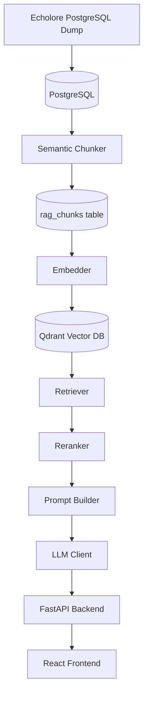
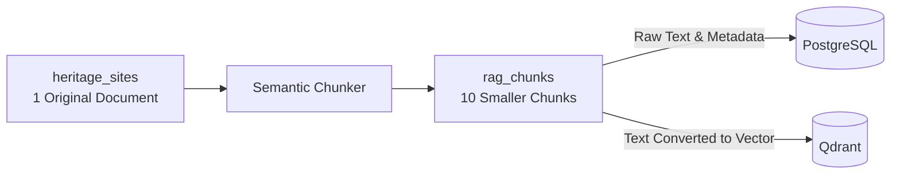
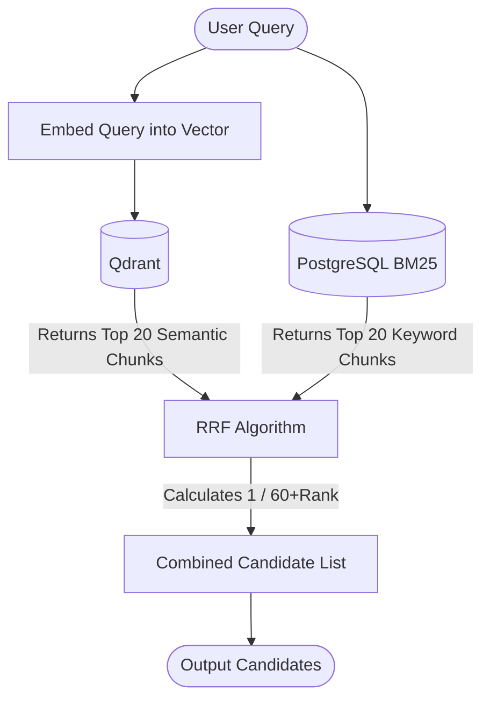
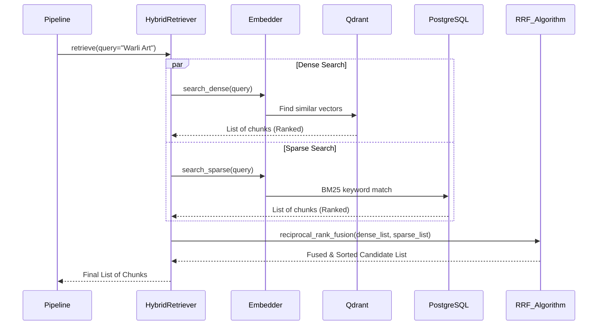

# Arkana Architecture Learning Notes

This document is a progressive learning notebook designed to teach the architecture of the Arkana repository from first principles. It is built module-by-module, acting as a single source of truth for understanding how data flows from the frozen Echolore database through the Arkana AI pipeline, and finally to the React frontend.

---

## Glossary

Before diving into the architecture, here are a few key terms to know:

- **Heritage Site**: An original, complete historical article or document stored in the main database.
- **Chunk**: A smaller, digestible piece of a larger document.
- **Embedding**: The process of translating human language into a mathematical format.
- **Vector**: An array of numbers that represents the meaning of a chunk of text.
- **Qdrant**: A specialized database designed to store vectors and search for them by meaning.
- **PostgreSQL**: A traditional database excellent at storing exact data and performing exact keyword searches.
- **BM25**: A standard industry algorithm for traditional keyword-based search (used by PostgreSQL).
- **Semantic Search**: Searching by the *meaning* of words (e.g., matching "ancient structure" with "old building") rather than the exact characters.

---

## High Level Architecture

The overall pipeline of Arkana operates as a linear progression of data extraction, embedding, retrieval, and generation. 

### End-to-End Journey of One Document

Here is a simplified look at how one article travels through the entire Arkana pipeline:

1. **heritage_sites**: A massive encyclopedia article about "Warli Art" is restored into the database.
2. **Semantic Chunker**: The AI reads the article and slices it into 15 smaller paragraphs, keeping related sentences together.
3. **rag_chunks**: These 15 raw paragraphs are saved in a table so we can do exact keyword searches later.
4. **Embedder**: The 15 paragraphs are converted into 15 arrays of numbers (vectors).
5. **Qdrant**: The 15 vectors are saved in the vector database so we can do meaning-based searches later.
6. **Retriever**: A user asks "What are some tribal paintings from Maharashtra?". The Retriever searches both Qdrant and PostgreSQL and finds the best 5 chunks.
7. **Reranker**: The 5 chunks are double-checked and sorted so the most relevant one is at the top.
8. **Prompt Builder**: The top chunks are packaged into strict instructions for the AI ("Answer the user using ONLY these sources").
9. **LLM**: The AI reads the instructions and streams an answer back.
10. **FastAPI**: The backend server acts as a bridge, sending the AI's answer over the internet.
11. **React**: The beautiful frontend website displays the answer to the user in a chat window.

### Current Architecture vs Final Architecture

**Current State (What exists now):**
The codebase is currently fragmented. The Python AI pipeline (Chunker, Embedder, Retriever, LLM) works perfectly but sits in isolation without a way to talk to the web. The React frontend is beautiful but displays fake, hardcoded mock data. There are also two duplicate Auth servers (one in Flask, one in Express) causing confusion.

**Final State (Where we are going):**
A unified, clean system. Echolore handles all raw data extraction. A single FastAPI server exposes the Python AI pipeline to the internet. The React UI connects to FastAPI to fetch real, live data. All duplicate servers and legacy mockups are deleted.

*Note: Currently, only Module 1 and Module 2 have been studied in detail.*

---

## Module 1: Semantic Chunker

### Purpose
The Semantic Chunker's job is to take massive, unstructured documents (like encyclopedia entries or historical archives) and slice them into smaller, digestible pieces called "chunks." 

### Why Semantic Chunking is Needed
Imagine a book. If you just cut the book every 500 characters, you might slice a sentence right in half. Semantic chunking prevents this. It uses a small, fast AI model to understand the *meaning* of the text. It groups related sentences together and only draws a boundary when the topic naturally shifts, ensuring that every chunk contains a complete, coherent thought.

### Input
- **Raw Text**: A long historical document.
- **Metadata**: Details about the text (e.g., the tribe it belongs to, the region, the publisher).

### Output
- **Chunks**: A list of small, focused text blocks. Each block carries an exact copy of the original metadata, so no context is lost.

### Execution Flow
1. The chunker receives a long document and cleans up messy text (like stray page numbers).
2. It breaks the text into individual sentences.
3. It measures the "mathematical similarity" between Sentence A and Sentence B.
4. If they are similar, they stay together. If they are very different, a boundary is drawn.
5. It enforces a size limit (around 512 tokens) and adds a small "overlap" (copying the end of the previous chunk into the beginning of the next) so pronouns like "he" or "it" don't lose their reference.

### Strengths
- **Context Preservation:** The overlap prevents catastrophic context loss at the boundaries.
- **Source-Aware:** It has different sensitivity thresholds for different archives (e.g., messy academic texts vs. clean museum labels).

### Weaknesses
- Counting tokens is done using rough approximation (`length / 4`) rather than an exact tokenizer, which is fast but occasionally inaccurate.

### Where it fits in the pipeline
It sits at the very beginning of the Arkana data ingestion pipeline. It reads from the raw `heritage_sites` database table and passes its output directly to the Embedder.

### What I Should Remember
- The chunker uses a small, fast AI model purely to figure out *where* to cut the text, not to build the final search database.
- It slices by topic shifts, not by character counts.
- The 50-token overlap ensures that no concept is left orphaned across a boundary.

---

## Module 2: Embedder

### Purpose
The Embedder translates human language into mathematical arrays (vectors). This allows the system to compare the meaning of a user's question against the meaning of thousands of historical chunks instantly.

### Why Embeddings are Needed
Computers don't understand words. If a user searches for "ancient structures," a traditional database will only look for those exact two words. An embedding model turns "ancient structures" into a mathematical coordinate. Because "old buildings" and "ancient structures" end up near each other in this mathematical space, the computer knows they mean the same thing.

### Input
- The list of text chunks produced by the Semantic Chunker.

### Output
- **Vectors**: Each chunk is transformed into a list of 768 numbers representing its semantic meaning.

### Why Both PostgreSQL and Qdrant?

This is a critical architectural decision. Why do we write to two different databases? 
They are solving two different problems:

1. **`heritage_sites` (PostgreSQL)** stores the original, massive documents exactly as they came from Echolore.
2. The **Semantic Chunker** slices one massive document into many smaller, searchable pieces.
3. These pieces are stored in **`rag_chunks`**.
4. The **Embedder** generates mathematical vectors for these pieces.
5. The vectors go to **Qdrant** because Qdrant is heavily optimized to perform math (Cosine Distance) to find semantic similarities instantly. 
6. The raw chunk text and metadata go to **PostgreSQL (`rag_chunks`)** because Postgres is exceptional at traditional keyword search (BM25) and exact metadata filtering (e.g., `WHERE region = 'Maharashtra'`).

This dual-write architecture is not duplication; it gives Arkana a "hybrid" brain. Qdrant handles the *meaning*, and Postgres handles the *exact matches*.

### Execution Flow
1. The Embedder receives chunks.
2. It feeds the text into a heavy, highly accurate model (`all-mpnet-base-v2`) in batches of 32.
3. It attaches the resulting 768-number vector to the chunk.
4. It sends the vectors and metadata to Qdrant.
5. It sends the raw text and metadata to PostgreSQL.

### Strengths
- **Idempotent:** The database writes use "upserts" (update if exists). You can run the embedder on the same data 100 times, and it will safely overwrite old data without creating duplicates.
- **Hybrid Power:** By writing to both DBs simultaneously, it perfectly aligns the Qdrant IDs with the Postgres IDs.

### Weaknesses
- **No Atomic Transactions:** If Qdrant succeeds but PostgreSQL crashes, the databases are out of sync. There is no built-in rollback mechanism to undo the Qdrant write.

### Where it fits in the pipeline
It is the final step of data ingestion. It takes the Semantic Chunker's output and permanently stores it in the databases, making the data ready for user queries.

### What I Should Remember
- The Embedder uses a heavy, 768-dimension model for high accuracy.
- It writes to **two databases at once** using the exact same ID (`chunk_id`).
- Qdrant is for *meaning* (Semantic Search). PostgreSQL is for *exact keywords* (Sparse Search).

### Self Check

To verify your understanding of Module 1 and Module 2, try answering these questions:

1. What is the main difference between what Qdrant does and what PostgreSQL does in this architecture?
2. Why is "semantic chunking" better than simply cutting a text every 500 characters?
3. What is the purpose of the 50-token "overlap" in the Semantic Chunker?
4. If a single heritage site article is broken into 10 chunks, how many vectors are created by the Embedder?
5. Why is it so important that the `chunk_id` is identical in both Qdrant and PostgreSQL?
6. What happens if you run the Embedder on the exact same data twice?
7. *(True/False)* The Semantic Chunker uses a heavy 768-dimension model to ensure its boundaries are perfectly accurate.

*(Answers: 1. Qdrant does meaning/semantic search, Postgres does exact keyword search. 2. It preserves coherent thoughts and sentences instead of slicing them in half. 3. It ensures context (like pronouns) isn't lost across chunk boundaries. 4. Ten vectors. 5. So the Hybrid Retriever can merge the results from both databases accurately. 6. It safely updates/overwrites the old data without duplicating it. 7. False, it uses a small, fast model (`MiniLM`) purely for speed during boundary detection.)*

---

## Module 3: Retriever

### Purpose
The Retriever acts as Arkana's search engine. When a user asks a question, this module dives into our databases (Qdrant and PostgreSQL) to find the most relevant chunks of historical text. 

### Files Involved
- **`ai/ai/retrieval/rrf_fusion.py`**: The core file for this module. It manages the `HybridRetriever` class and contains the logic for Reciprocal Rank Fusion (RRF).
- **`ai/ai/embedding/embedder.py`**: The Retriever borrows the `search_dense()` and `search_sparse()` functions defined inside the Embedder to actually talk to the databases.

### Inputs
The Retriever expects:
- **User Query**: The raw text question asked by the user (e.g., "Tell me about Warli art").
- **Filters (Optional)**: Specific metadata constraints (e.g., "Only search within the Maharashtra region").
This data originates directly from the user's input on the React frontend.

### Internal Workflow
Here is how the Retriever processes a single query:

User Query
↓
Query Embedding (converting the question into math)
↓
Dense Search (asking Qdrant for semantic matches)
↓
Sparse Search (asking PostgreSQL for keyword matches)
↓
Reciprocal Rank Fusion (RRF) (merging both lists)
↓
Candidate List (the final top chunks)

### Retrieval Techniques

#### Dense Search
- **What it is:** Searching by *meaning* using vectors in Qdrant.
- **Why it exists:** If a user searches for "ancient rulers", Dense Search is smart enough to return chunks containing "old kings" or "early dynasties", even if the exact words "ancient rulers" never appear in the text.

#### Sparse Search
- **What it is:** Searching by *exact keywords* using PostgreSQL.
- **Why it exists:** If a user searches for a highly specific name, like "Raja Ravi Varma", Dense Search might accidentally return other painters because their "meaning" is similar. Sparse Search ensures we find the exact name.

#### Hybrid Search
- **What it is:** Doing both Dense and Sparse searches at the same time and combining the results.
- **Why it exists:** It gives us the best of both worlds—the nuance of meaning and the precision of keywords.

### BM25 from First Principles

BM25 stands for "Best Matching 25." It is the algorithm PostgreSQL uses for Sparse Search.
Imagine you have a library of books and you search for "The Tiger". 
1. **Term Frequency (TF):** If Book A mentions "Tiger" 50 times and Book B mentions it 2 times, Book A is probably more relevant. BM25 rewards chunks that mention the keyword frequently.
2. **Inverse Document Frequency (IDF):** The word "The" appears in almost every book, so it's useless for searching. The word "Tiger" is rare. BM25 mathematically penalizes common words and rewards rare words. 
3. **Chunk Length:** A short 3-sentence chunk mentioning "Tiger" once is highly focused. A massive 500-page book mentioning "Tiger" once is probably not about tigers. BM25 penalizes overly long chunks.

In short, BM25 scores a chunk highly if it contains rare keywords frequently, while remaining relatively short.

### Reciprocal Rank Fusion (RRF)

**Why RRF is needed:**
Dense Search and Sparse Search output totally different types of scores. Dense outputs a cosine decimal (e.g., `0.85`), while BM25 outputs a massive integer (e.g., `42.5`). You cannot compare these numbers directly. RRF solves this by entirely ignoring the scores and looking only at the *rank* (1st place, 2nd place, etc.).

**How it works:**
It uses the formula `1 / (k + rank)`. In Arkana, `k` is set to 60. 
If a chunk is ranked 1st, it gets `1 / (60 + 1) = 0.016`.
If a chunk is ranked 10th, it gets `1 / (60 + 10) = 0.014`.
It calculates this for both lists and adds the fractions together.

**Simple Numerical Example:**
Imagine Chunk A is 1st in Dense Search, but 10th in Sparse Search.
- Dense score: `1 / 61 = 0.0163`
- Sparse score: `1 / 70 = 0.0142`
- Final RRF Score: `0.0163 + 0.0142 = 0.0305`

### Why Hybrid Retrieval is Better (Practical Example)
Imagine a user asks: *"When was the Taj Mahal built?"*
- **Only Sparse (Keyword):** Might return a chunk saying: *"The Taj Mahal hotel was built in Mumbai..."* (Wrong Taj Mahal, but exact keyword match).
- **Only Dense (Meaning):** Might return a chunk saying: *"The Red Fort was constructed by Mughal emperors in the 17th century."* (Right era, right builders, but wrong building).
- **Hybrid:** Finds the chunk that has the exact keyword ("Taj Mahal") AND the semantic meaning (construction, history). 

### Runtime Flow Diagram

### Sequence Diagram

### End-to-End Example
**User Query:** *"What materials are used in Warli painting?"*
1. **Query Embedding:** The question is converted into a 768-number array by the Embedder.
2. **Dense Search:** Qdrant returns 20 chunks conceptually related to tribal painting materials.
3. **Sparse Search:** PostgreSQL returns 20 chunks containing the exact words "materials" and "Warli painting".
4. **RRF Fusion:** 
   - Chunk ID `abc-123` (which mentions rice paste and Warli art) was ranked 2nd in Dense and 1st in Sparse.
   - Its RRF score is `(1/62) + (1/61) = 0.0325`.
   - It beats all other chunks and becomes the #1 candidate.
5. **Output:** A combined list of the top 20 candidate chunks is returned to the pipeline.

### Strengths
- **Resilience:** If one search method fails to find good results (e.g., a spelling error breaks BM25), the other method acts as a safety net.
- **Parallelism:** The dense and sparse searches are executed asynchronously at the same time, cutting retrieval latency in half.

### Weaknesses
- **No Early Exit:** It always retrieves 20 chunks from both DBs and calculates RRF, even if the user asked a simple question where the first hit was a 100% perfect match.

### Relationship with Previous Modules
To be very clear:
- **Module 1 (Chunker)** produced the chunks.
- **Module 2 (Embedder)** stored those chunks in the databases.
- **Module 3 (Retriever)** does absolutely no processing or storing of new data. It ONLY searches what Module 2 previously stored.

### Where Module 4 Begins
The Retriever successfully finds a broad list of 20 good candidates. However, RRF is just a mathematical trick; it doesn't actually read the text to ensure the chunks answer the user's question. 
The Retriever outputs this list of 20 candidates and hands them directly to **Module 4 (Reranker)**, which acts as a strict judge to filter out the bad results before they reach the AI.

### What I Should Remember
- The Retriever does not modify data; it just reads what is already in Qdrant and PostgreSQL.
- It uses Hybrid Search to get the best of both worlds: Semantic (meaning) and Sparse (keywords).
- BM25 finds rare keywords in short texts.
- RRF combines results by looking purely at their *rank/position*, ignoring their raw scores completely.

### Self Check
To verify your understanding of Module 3, try answering these questions:

1. Why do we need Sparse Search if Dense Search already understands the "meaning" of a query?
2. Explain the fundamental idea behind BM25 to a non-technical person.
3. Why is Reciprocal Rank Fusion necessary? Why can't we just add the scores from Qdrant and PostgreSQL together?
4. What does the `k` (default 60) in the RRF formula `1 / (k + rank)` do? (Hint: It prevents 1st place from getting too massive an advantage over 2nd place).
5. Does the Retriever modify the `rag_chunks` database?
6. *(True/False)* The Dense and Sparse searches wait for each other to finish before calculating RRF.

*(Answers: 1. Because Dense Search can sometimes miss exact names or highly specific nouns that have muddy semantic meaning. 2. It rewards texts that use rare search words frequently, but penalizes texts that are overly long. 3. Because they are on completely different scales—Qdrant uses decimals, Postgres uses massive integers. 4. It smooths out the curve, ensuring rank 1 and rank 5 are treated somewhat similarly, rather than rank 1 dominating completely. 5. No, it is purely a read-only operation. 6. False, they are executed in parallel to save time.)*

---

## Progress

- [x] Module 1 Completed: Semantic Chunker
- [x] Module 2 Completed: Embedder
- [x] Module 3 Completed: Retriever
- [ ] Module 4: Reranker
- [ ] Module 5: Prompt Builder
- [ ] Module 6: LLM Client
- [ ] Module 7: Pipeline
- [ ] Module 8: FastAPI
- [ ] Module 9: React
