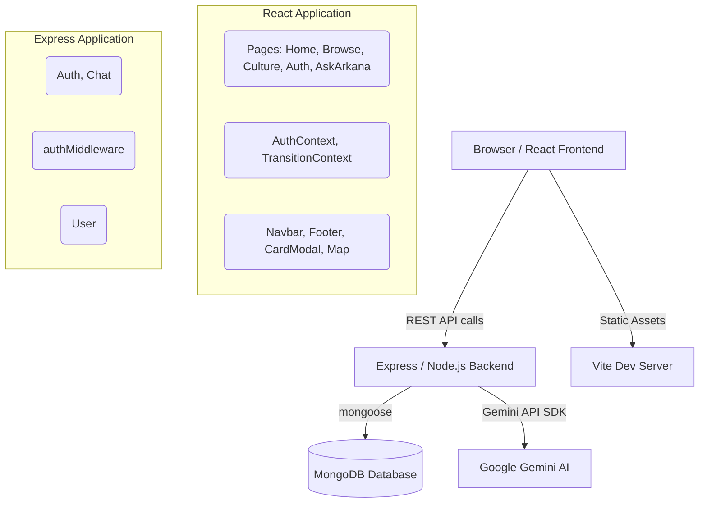

# ARKANA Project Dossier
> Master Project Documentation for ARKANA
> **Generated on**: 2026-07-25

## 1. Repository Information
- **Repository**: ARKANA
- **Git Remotes**: 
  - `origin https://github.com/Lola381/Arkana.git (fetch)`
  - `origin https://github.com/Lola381/Arkana.git (push)`
- **Current Branch**: `main`
- **Working Tree**: Clean

### Recent Commits (Top 4)
1. `45d42ea` Update arkana-react README.md
2. `425cf9c` Update Arkana React app with Ask Arkana AI map chat, working filters, card modal details, and auth fix
3. `ea61b7a` Add Arkana React app updates and backend
4. `2d25aea` Add arkana-react project

---

## 2. Architecture Overview
ARKANA is a modern web application consisting of a React frontend and an Express/Node.js backend, primarily focused on showcasing Indian heritage, culture, and artifacts.

### Flow 1: Authentication
1. **Frontend**: User enters credentials in `/login` or `/register` page.
2. **Frontend Context**: Dispatches API request to backend `/api/auth/login`.
3. **Backend Route**: Validates user via `User` model, matches password (bcrypt).
4. **Backend Response**: Returns JWT token in JSON payload.
5. **Frontend Context**: Saves token to `localStorage` and updates user state.

### Flow 2: AI Map Chat (Ask Arkana)
1. **Frontend**: User inputs a question in `/ask` interface.
2. **Backend**: Dispatches query to `/api/chat/ask`.
3. **Backend Logic**: Sends system prompt + user question to Google Gemini model.
4. **Backend Response**: Returns structured JSON (coordinates, period, descriptions).
5. **Frontend Map**: Renders map polygons (Leaflet) based on coordinates returned.

---

## 3. Directory and File Breakdown

### Root Directory (`d:\SPD2\arkana-react`)
- **`package.json`**: NPM scripts (`dev`, `build`, `lint`, `preview`), frontend dependencies (React, Leaflet, Framer Motion, Tailwind).
- **`package-lock.json`**: Exact dependency tree.
- **`vite.config.js`**: Configuration for Vite bundler, defining React plugins.
- **`eslint.config.js`**: Linting rules.
- **`index.html`**: Entry point for the frontend app.
- **`README.md`**: Standard project overview.
- **`server.py`**: Python-based mock/development server (uses Flask) observed in processes, though the main backend resides in `backend/` using Node.js.

### Frontend Source (`src/`)
- **`main.jsx`**: React root rendering and Context provider setup.
- **`App.jsx`**: React Router configuration and layout wrapping.
- **`index.css` & `App.css`**: Global CSS, theming, and layout utility classes.
- **`components/`**:
  - `Navbar.jsx`, `Footer.jsx`: Global layout components.
  - `ArticleCard.jsx`: Reusable card component for artifacts.
  - `CardModal.jsx`: Shared expanded-view modal for artifact details.
  - `Map.jsx`, `MapComponent.jsx`: Leaflet-based map integration.
  - `TransitionContext.jsx`: Page transition routing context.
  - `ScrollReveal.jsx`: On-scroll animation wrapper.
- **`pages/`**:
  - `Home.jsx`: Landing page.
  - `Browse.jsx`: Artifact browsing with sidebar filtering (region, period, art form).
  - `Culture.jsx`: Warli painting showcase, using `CardModal`.
  - `AskArkana.jsx`: AI-driven map interface.
  - `Auth.jsx`: Login/Register component wrapper.
- **`data/`**:
  - `artifacts.js`: Hardcoded JSON object collections containing rich mock data for `BROWSE_ARTIFACTS` and `WARLI_ARTIFACTS`.
  - `chatResponses.js`: Mock AI responses fallback data.
- **`assets/`**: Static image assets and icons.

### Backend Source (`backend/`)
- **`app.js`**: Express server setup, CORS configuration, and route registration.
- **`index.js`**: Server entrypoint and MongoDB connection logic.
- **`package.json`**: Backend dependencies (express, mongoose, bcrypt, jsonwebtoken, @google/genai).
- **`.env`**: (Ignored in Git, but template) Environment variables like `PORT`, `MONGO_URI`, `JWT_SECRET`, `GEMINI_API_KEY`.
- **`controllers/`**:
  - `authController.js`: Handles user login/registration.
  - `chatController.js`: Integrates with Gemini AI for map queries.
- **`routes/`**:
  - `authRoutes.js`: Maps POST `/register`, POST `/login`.
  - `chatRoutes.js`: Maps POST `/ask`.
- **`models/`**:
  - `User.js`: Mongoose schema for user (name, email, password hashes).
- **`middleware/`**:
  - `authMiddleware.js`: Verifies JWT tokens on protected routes.
- **`db/`**:
  - `connect.js`: MongoDB connection utility.

---

## 4. Environment Variables

### Backend (`backend/.env`)
*Must be provided for backend to function.*
| Variable | Description |
|---|---|
| `PORT` | Backend listener port (default: 5000) |
| `MONGO_URI` | MongoDB connection string |
| `JWT_SECRET` | Secret key for signing JSON Web Tokens |
| `GEMINI_API_KEY` | API Key for Google Gemini Generative AI |

---

## 5. Deployment & Configuration
- **Frontend Configuration**: Bundled via Vite (`vite.config.js`). Ready to be deployed as static assets to Vercel/Netlify.
- **Backend Configuration**: Node/Express server. Can be deployed to Heroku, Render, or a VPS.
- **Database**: Requires a MongoDB instance (local or Atlas).
- **Docker**: **Not found in repository**. There are no `Dockerfile` or `docker-compose.yml` configurations within the active `arkana-react` project.
- **CI/CD Workflows**: **Not found in repository**. No `.github/workflows` or similar CI configuration present.

---

## 6. Audit Findings & Metrics

### Production Readiness Assessment
- **Frontend**: Good shape. Code is functional, responsive, and styled. Vite is configured correctly for production builds (`npm run build`).
- **Backend**: Basic, but functional. Uses proper password hashing (bcrypt) and JWT for stateless authentication.
- **Data Access**: Currently, much of the frontend data (artifacts) is hardcoded in `src/data/artifacts.js` instead of being fetched from the backend. This is not strictly production-ready for dynamic scaling, though suitable for MVP/Presentation.

### Code Quality & Technical Debt
- **Tech Debt**: 
  - `server.py` and Node.js `backend/` coexist. `server.py` seems to be an older/alternative mock server running concurrently, causing fragmentation.
  - Hardcoded API URLs in frontend components. Should be abstracted to a config or `.env` file using `VITE_API_URL`.
  - Mix of static mock data and backend AI features.
- **Security Audit**:
  - Passwords hashed using `bcrypt` (secure).
  - JWT used for auth (secure if SECRET is strong).
  - Minor Deprecation Warnings found in `server.py` regarding `datetime.utcnow()` (should be replaced with timezone-aware datetime).
- **Performance**:
  - Asset optimization: Heavy use of large images without clear lazy-loading strategies other than standard browser behavior.
  - Animations: Framer-motion used effectively, performance is generally smooth.
- **Testing**: **Not found**. No unit test frameworks (Jest, Vitest) or test files are configured in the repository.

---

## 7. Database Schema
Currently, only a single model is defined in the application (MongoDB via Mongoose).

**Collection**: `users`
- `_id`: ObjectId (Auto-generated)
- `name`: String (Required)
- `email`: String (Required, Unique)
- `password`: String (Required, Bcrypt hashed)
- `createdAt`: Date (Default: `Date.now`)

*(Note: Artifacts, Cultures, and AI Chat history are NOT currently stored in the database).*

---

## 8. Future Roadmap Recommendations
1. **Database Expansion**: Move all artifact and culture data from `src/data/artifacts.js` into MongoDB and build CRUD APIs.
2. **Environment Configuration**: Centralize frontend API URLs to `.env`.
3. **Testing Implementation**: Introduce `vitest` for frontend components and `jest` for backend endpoints.
4. **CI/CD & Docker**: Containerize the frontend and backend using Docker, and set up GitHub Actions for automated linting and building.
5. **Consolidate Servers**: Remove the legacy `server.py` to prevent confusion and consolidate entirely into the Node.js `backend/`.
