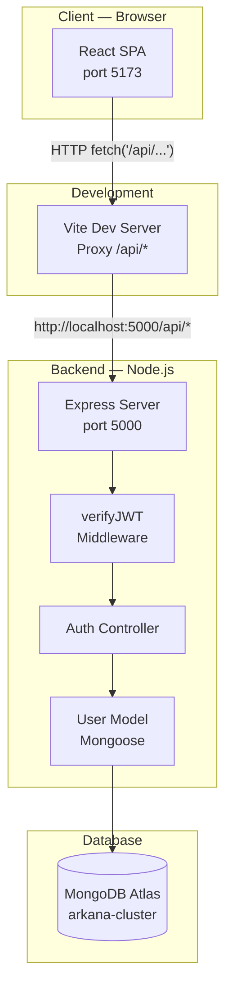
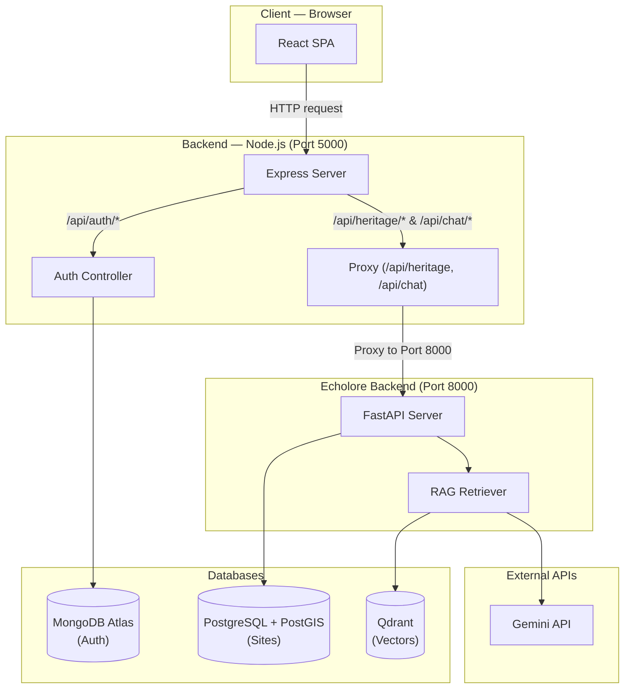
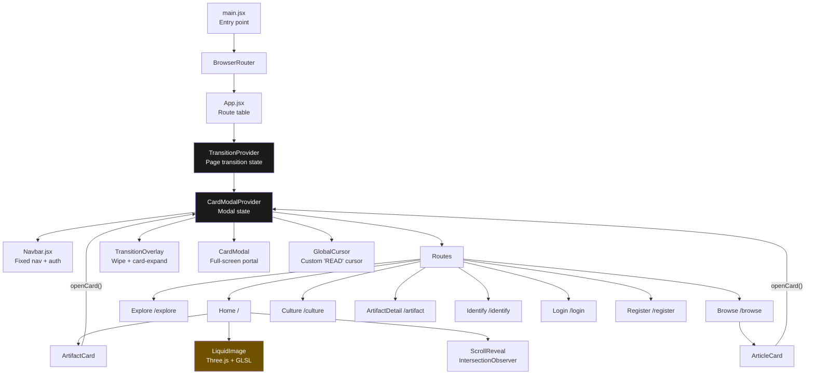
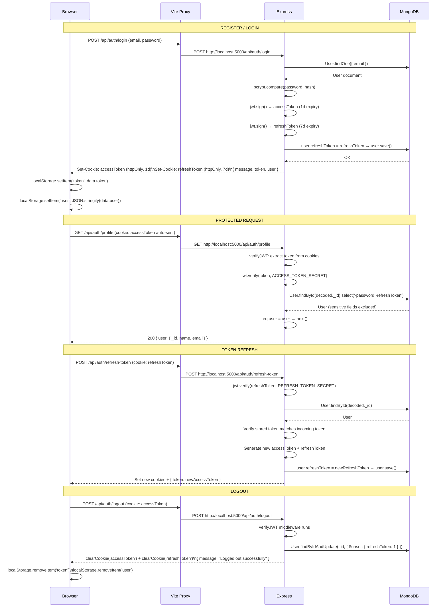
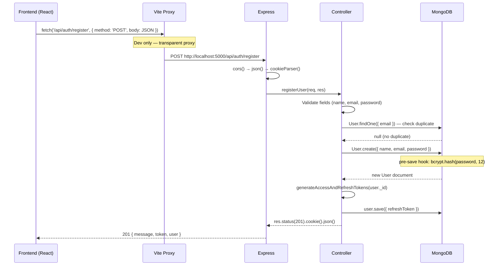
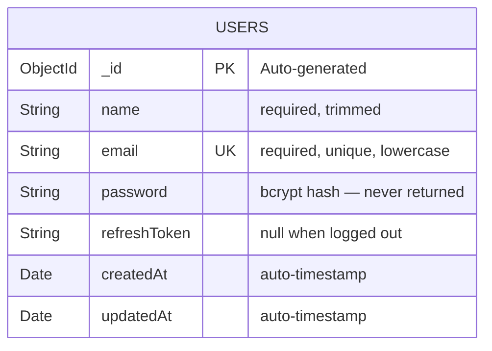

# ARKANA — System Architecture

## System Overview

ARKANA is a full-stack monorepo containing a React 19 SPA (frontend) and a Node.js/Express REST API (backend),
backed by MongoDB Atlas. In development, Vite proxies all `/api/*` requests to the Express server on port 5000.

### Current Architecture



### Planned Future Architecture (Echolore Integration)
*The Echolore repository will provide a FastAPI backend to serve heritage data and RAG chat. The Node.js server will act as an API gateway for these routes.*



---

## Component Interaction



---

## Frontend Architecture

The frontend is a **React 19 SPA** using:
- **React Router DOM v7** for client-side routing (8 routes)
- **Two React Contexts** for global state (`TransitionContext`, `CardModalContext`)
- **Vanilla CSS design tokens** (`index.css`) + **Tailwind CDN** for utilities
- **Static data layer** (`src/data/artifacts.js`) for all artifact/culture content

### State Management Strategy

| State Type | Mechanism |
|------------|-----------|
| Page transition animation | `TransitionContext` (React Context) |
| Card modal open/close | `CardModalContext` (React Context) |
| Auth session (UI) | `localStorage` (`token`, `user`) |
| Auth session (API) | `httpOnly` cookies (`accessToken`, `refreshToken`) |
| Page-level UI state | `useState` / `useRef` (local) |
| Scroll animation | `IntersectionObserver` (DOM, no state) |

### Context Providers

#### `TransitionContext`
**File:** `src/components/TransitionContext.jsx`

Manages page transition animations. Provides two transition modes:

| Mode | Trigger | Animation |
|------|---------|-----------|
| Geometric Wipe | `triggerWipe(path)` | 4 horizontal panels wipe across screen |
| Card Expand | `triggerCardExpand(path, el)` | Card element scales to fill viewport |

**Custom exports:** `TransitionLink`, `TransitionNavLink`, `useTransition()`

#### `CardModalContext`
**File:** `src/components/CardModalContext.jsx`

Manages the full-screen artifact detail modal. Tracks modal state (`isOpen`, `artifact`, `originX`, `originY`).

**Custom export:** `useCardModal()`

---

## Backend Architecture

The backend is a **Node.js/Express REST API** using the CommonJS module system.

### Middleware Stack (applied globally)
```
Request
  │
  ├── cors()           — Validates Origin header against CORS_ORIGIN env var
  ├── express.json()   — Parses JSON body (limit: 16kb)
  ├── express.urlencoded() — Parses URL-encoded body (limit: 16kb)
  └── cookieParser()   — Parses cookies (for JWT token extraction)
  │
  └── Router → /api/auth/*
        │
        ├── Public routes (no auth check)
        └── Protected routes → verifyJWT → controller
```

### Module Dependency Graph
```
index.js
  ├── require('dotenv').config()
  ├── require('./db')          → mongoose.connect(MONGODB_URI/arkana)
  └── require('./app')
        ├── require('express')
        ├── require('cors')
        ├── require('cookie-parser')
        └── require('./routes/auth.routes')
              ├── require('./controllers/auth.controller')
              │     ├── require('../models/user.model')
              │     │     ├── require('mongoose')
              │     │     ├── require('bcryptjs')
              │     │     └── require('jsonwebtoken')
              │     ├── require('jsonwebtoken')
              │     └── require('../constants')
              └── require('../middleware/auth.middleware')
                    ├── require('jsonwebtoken')
                    └── require('../models/user.model')
```

---

## Authentication Flow



---

## API Flow



---

## Database Interaction



> **Current state:** Only the `users` collection exists. All artifact, culture, and heritage data
> is served from the static file `src/data/artifacts.js` (9 exported arrays). A MongoDB `artifacts`
> collection is a planned future improvement.

---

## Design System

The visual language is defined in two places:

| File | Role |
|------|------|
| `src/index.css` | CSS custom properties (design tokens), animation classes, component styles |
| `index.html` | Tailwind CDN config with extended color/spacing/font tokens |
| `heritage_editorial/DESIGN.md` | Full design system specification document |

### Core Design Tokens

```css
--color-surface:          #fbf9f5   /* Warm parchment white — main background */
--color-on-surface:       #1b1c1a   /* Near-black text */
--color-primary:          #6f5100   /* Deep heritage gold — links, active states */
--color-primary-container:#8b6914   /* Heritage gold — accents */
--color-outline-variant:  #d1c5b2   /* Warm grey — borders, dividers */
--font-display: 'Playfair Display', serif
--font-body:    'Inter', sans-serif
--ease-museum:  cubic-bezier(0.16, 1, 0.3, 1)  /* Springy, gallery-quality */
--ease-sharp:   cubic-bezier(0.77, 0, 0.175, 1) /* Fast entry, abrupt stop */
```


---

# ARKANA — API Documentation

**Base URL:** `http://localhost:5000/api`  
**Content-Type:** `application/json`  
**Authentication:** `httpOnly` cookie (`accessToken`) automatically sent by browser,
or `Authorization: Bearer <token>` header for programmatic access.

---

## Authentication

All protected endpoints require a valid access token. The token is issued as an `httpOnly` cookie
(`accessToken`) upon login or registration, and is automatically included in subsequent requests by
the browser. For programmatic access (e.g., from a mobile app or Postman), include the token in
the `Authorization` header:

```
Authorization: Bearer <access_token>
```

---

## Endpoints

### 1. Register

**`POST /auth/register`**

Creates a new user account. On success, sets `httpOnly` session cookies and returns the access token.

**Authentication Required:** No

**Request Body:**
```json
{
  "name":     "string — required",
  "email":    "string — required, must be unique",
  "password": "string — required, minimum 6 characters"
}
```

**Validation Rules:**
- All three fields must be non-empty after trimming
- Email is stored in lowercase
- Password is hashed with bcryptjs (12 rounds) before storage

**Success — `201 Created`:**
```json
{
  "message": "User registered successfully",
  "token":   "<JWT access token — 1 day expiry>",
  "user": {
    "name":  "Nilesh Gupta",
    "email": "nilesh@example.com"
  }
}
```

**Cookies Set:**
| Cookie | Value | Options |
|--------|-------|---------|
| `accessToken` | JWT (1 day) | `httpOnly`, `sameSite: lax` |
| `refreshToken` | JWT (7 days) | `httpOnly`, `sameSite: lax` |

**Error Responses:**
| Status | Body | Condition |
|--------|------|-----------|
| `400` | `{ "message": "Please fill in all fields" }` | Any field empty/missing |
| `409` | `{ "message": "Email address already registered" }` | Duplicate email |
| `500` | `{ "message": "Error creating account", "error": "..." }` | Server/DB error |

---

### 2. Login

**`POST /auth/login`**

Authenticates an existing user. On success, sets `httpOnly` session cookies and returns the access token.

**Authentication Required:** No

**Request Body:**
```json
{
  "email":    "string — required",
  "password": "string — required"
}
```

**Success — `200 OK`:**
```json
{
  "message": "Login successful",
  "token":   "<JWT access token — 1 day expiry>",
  "user": {
    "name":  "Nilesh Gupta",
    "email": "nilesh@example.com"
  }
}
```

**Cookies Set:**
| Cookie | Value | Options |
|--------|-------|---------|
| `accessToken` | JWT (1 day) | `httpOnly`, `sameSite: lax` |
| `refreshToken` | JWT (7 days) | `httpOnly`, `sameSite: lax` |

**Error Responses:**
| Status | Body | Condition |
|--------|------|-----------|
| `400` | `{ "message": "Please enter both email and password" }` | Missing field |
| `401` | `{ "message": "Invalid email or password" }` | Wrong email or password |
| `500` | `{ "message": "Server error", "error": "..." }` | Server/DB error |

---

### 3. Logout

**`POST /auth/logout`**

Clears the user's session by removing cookies and revoking the refresh token in the database.

**Authentication Required:** ✅ Yes — valid `accessToken` cookie or Bearer token

**Request Body:** None

**Success — `200 OK`:**
```json
{ "message": "Logged out successfully" }
```

**Cookies Cleared:** `accessToken`, `refreshToken`

**Side Effects:** Sets `refreshToken = null` in the user's MongoDB document via `$unset`.

**Error Responses:**
| Status | Body | Condition |
|--------|------|-----------|
| `401` | `{ "message": "Unauthorized — no token provided" }` | No token in cookie or header |
| `401` | `{ "message": "Access token expired" }` | Token expired |
| `401` | `{ "message": "Invalid access token" }` | Tampered or invalid token |
| `500` | `{ "message": "Server error" }` | DB error |

---

### 4. Refresh Access Token

**`POST /auth/refresh-token`**

Rotates the access token using the refresh token. Both tokens are replaced (refresh token rotation).

**Authentication Required:** No (uses refresh token cookie)

**Request Body (optional — used if cookies are not available):**
```json
{ "refreshToken": "<refresh JWT>" }
```

**Token Priority:** Reads `refreshToken` from `req.cookies?.refreshToken` first, then `req.body?.refreshToken`.

**Success — `200 OK`:**
```json
{
  "message": "Access token refreshed",
  "token":   "<new JWT access token>"
}
```

**Cookies Updated:**
| Cookie | New Value |
|--------|-----------|
| `accessToken` | New JWT (1 day) |
| `refreshToken` | New JWT (7 days) — old one is revoked |

**Security Notes:**
- The incoming refresh token is verified against the stored value in MongoDB
- If they don't match, request is rejected (detects stolen/replayed tokens)
- New refresh token is saved to MongoDB, invalidating the old one

**Error Responses:**
| Status | Body | Condition |
|--------|------|-----------|
| `401` | `{ "message": "No refresh token provided" }` | No refresh token found |
| `401` | `{ "message": "Refresh token is invalid or expired" }` | Bad or expired token |

---

### 5. Get Profile

**`GET /auth/profile`**

Returns the authenticated user's profile information.

**Authentication Required:** ✅ Yes — valid `accessToken` cookie or Bearer token

**Request Body:** None

**Success — `200 OK`:**
```json
{
  "user": {
    "_id":   "64f8a2b3c4d5e6f7a8b9c0d1",
    "name":  "Nilesh Gupta",
    "email": "nilesh@example.com"
  }
}
```

**Security Note:** Password and `refreshToken` are explicitly excluded using Mongoose's `.select('-password -refreshToken')`.

**Error Responses:**
| Status | Body | Condition |
|--------|------|-----------|
| `401` | `{ "message": "Unauthorized — no token provided" }` | No token |
| `401` | `{ "message": "Unauthorized — user not found" }` | Token valid but user deleted |
| `401` | `{ "message": "Access token expired" }` | Expired token |
| `401` | `{ "message": "Invalid access token" }` | Tampered token |

---

### 6. Health Check

**`GET /health`**

Verifies the server is running. Useful for deployment health probes and uptime monitoring.

**Authentication Required:** No

**Success — `200 OK`:**
```json
{
  "status":    "ok",
  "timestamp": "2026-07-11T04:00:00.000Z"
}
```

---

## JWT Token Structure

### Access Token Payload
```json
{
  "_id":   "64f8a2b3c4d5e6f7a8b9c0d1",
  "email": "nilesh@example.com",
  "name":  "Nilesh Gupta",
  "iat":   1720666200,
  "exp":   1720752600
}
```

### Refresh Token Payload
```json
{
  "_id": "64f8a2b3c4d5e6f7a8b9c0d1",
  "iat": 1720666200,
  "exp": 1721271000
}
```

---

## Error Format

All error responses follow this consistent format:
```json
{
  "message": "Human-readable error description",
  "error":   "Technical detail (only on 500 errors)"
}
```

---

## Testing with curl

```bash
# Register
curl -X POST http://localhost:5000/api/auth/register \
  -H "Content-Type: application/json" \
  -d '{"name":"Test User","email":"test@example.com","password":"secret123"}' \
  -c cookies.txt

# Login
curl -X POST http://localhost:5000/api/auth/login \
  -H "Content-Type: application/json" \
  -d '{"email":"test@example.com","password":"secret123"}' \
  -c cookies.txt

# Get Profile (uses saved cookies)
curl http://localhost:5000/api/auth/profile -b cookies.txt

# Refresh Token
curl -X POST http://localhost:5000/api/auth/refresh-token -b cookies.txt -c cookies.txt

# Logout
curl -X POST http://localhost:5000/api/auth/logout -b cookies.txt

# Health Check
curl http://localhost:5000/api/health
```

---

## Planned Future Endpoints (Echolore Integration)

The following endpoints are planned for Phase 3 via integration with the Echolore FastAPI backend. The Node.js server will proxy these requests.

| Method | Endpoint | Description | Backend Source |
|--------|----------|-------------|----------------|
| `GET` | `/api/heritage/sites` | List heritage sites (pagination, filters like `state`, `category`) | PostgreSQL |
| `GET` | `/api/heritage/sites/:id` | Get full details for a single site by UUID | PostgreSQL |
| `POST` | `/api/chat/ask` | RAG Chat API (returns text, citations, geoData) | Qdrant + Gemini |
| `GET` | `/api/map/bounds` | Fetch GeoJSON polygons/markers for viewport | PostGIS |
| `POST` | `/api/search` | Semantic and Full-Text search across heritage corpus | Qdrant/PostgreSQL |
| `POST` | `/api/identify` | Upload image, return similar artifacts (Future phase) | TBD |
